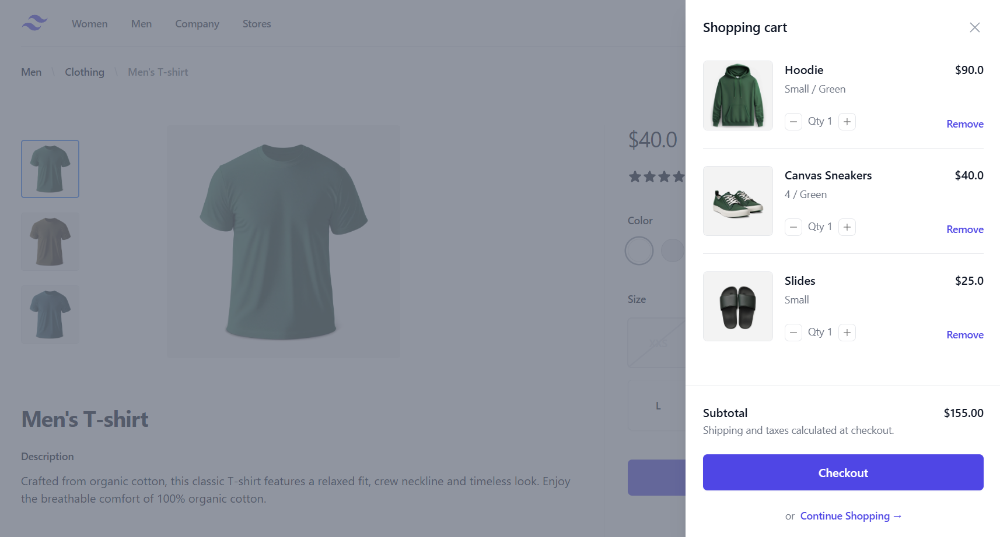

# E-Commerce App Build using React.js, Redux, Tailwindcss, React-Router

Live link: [E-Commerce App Build](https://vikasgupta-820.github.io/E-Commerce/)

## Table of Contents
- [Introduction](#introduction)
- [Features](#features)
- [Technologies](#technologies)
- [Demo](#Demo)

## Introduction

This is a modern e-commerce application built with React, Redux, React-Router and Tailwindcss. The app allows users to browse products, see the product details, add them to the cart, update the cart items, remove items from the cart.

## Features
- Browse products
- Product detail view
- Add products to cart
- Update cart items
- Responsiveness

## Technologies
- React.js
- Redux
- React-Router
- Tailwindcss

## Demo

Home

Product Details

Shopping Cart
